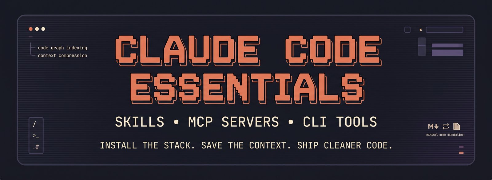
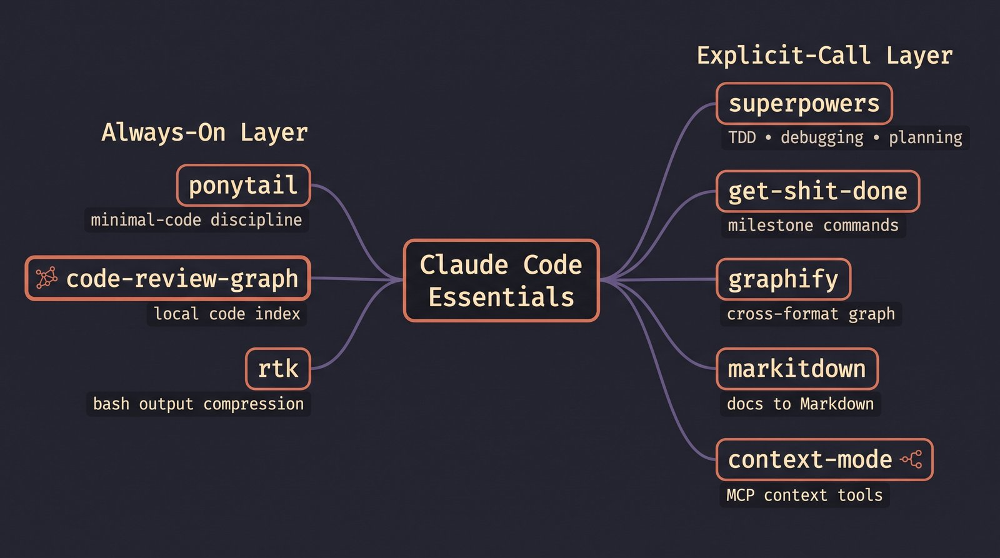

# claude-code-essentials



[](LICENSE)
[](https://claude.com/claude-code)
[](install.sh)

A curated, tested combination of Claude Code skills, MCP servers, and CLI
tools, installed with one script and explained with one README. Not an
exhaustive list of everything that exists. Every tool here was picked over
real alternatives, and the reasons are documented below, not just asserted.

**Tested against itself**: this repo's own components were exercised while
building it, not just described. `code-review-graph` indexed this exact
repository. `rtk` was verified compressing real command output (a raw
`pip list` at 19,520 bytes came back at 9,395 bytes through it). The
`.mcp.json` merge logic was tested against this project's actual existing
config, including a real `code-review-graph` entry with a custom `env`
field, confirming nothing gets overwritten. Where something didn't work as
expected during that testing, for example rtk's automatic hook not firing
in every environment, it's documented as a known limitation rather than
left out.

## Who this is for

Solo developers using Claude Code who want a working, opinionated setup
today, without evaluating a dozen plugins themselves first. If you don't
have `/plugin` access in your environment (some hosted or SDK-based Claude
Code sessions don't expose it), everything here still installs, since none
of it depends on that command.

**Not a fit if**: you're coordinating a team of agents (see `ruflo` in
[docs/COMPARISONS.md](docs/COMPARISONS.md), a better shape for that case),
or you specifically want the broadest possible token-saving coverage over a
proven track record (see the Token-max combination below instead).

## Trust and safety before you run this

- The script fetches from each tool's original upstream source at install
  time. Nothing is vendored or bundled; you're always getting the real
  project, not a copy.
- `pipx` isolates every Python-based tool in its own environment so nothing
  here touches your other projects' dependencies (see why below).
- No secrets, API keys, or credentials are requested or read anywhere in
  this script.
- Piping `curl | bash` runs a script you haven't read yet. Standard advice
  applies here too: open [install.sh](install.sh) and read it first, or
  download it and run `bash install.sh` locally instead of piping directly.

## Tested on

- Windows: Git Bash. PowerShell is not supported for `install.sh`; run it
  through Git Bash or WSL instead.
- WSL, macOS, and Linux: standard bash, should work as-is.
- Claude Code: verified in a standard `claude` CLI terminal session and in
  at least one hosted/SDK-based desktop session. The rtk automatic hook
  behaves differently between the two; see the note below.

## Install

```bash
curl -fsSL https://raw.githubusercontent.com/rishindra-mateti-tech/claude-code-essentials/main/install.sh | bash
```

Run it from inside the project you want MCP servers registered for. Restart
Claude Code afterward: skills, commands, and MCP servers load at session
start, not mid-session.

**Flags**: `--dry-run` (show what would happen, install nothing),
`--uninstall` (remove everything, see [docs/UNINSTALL.md](docs/UNINSTALL.md)),
`--skip-rtk`, `--skip-gsd`, `--skip-superpowers`, `--skip-graphify`,
`--skip-markitdown`, `--skip-context-mode`, `--skip-taste-skill`. Full list
in [docs/INSTALL.md](docs/INSTALL.md).

The script reports success and failure per component honestly. If a step
fails, it's listed under "FAILED" at the end, not silently counted as
installed.

## Quick example

Before this stack, a typical session looks like:

```
> git status
[300+ lines of raw output flood the context]
> "what calls this function?"
[Claude reads 8 files manually to find out]
```

After:

```
> git status
[rtk compresses it to a summary before it reaches context]
> "what calls this function?"
[code-review-graph answers from its pre-built index, no file reads needed]
> [writing a new helper function]
[ponytail checks: does this need to exist, or is it one line of stdlib?]
```

Same conversation, same questions, fewer tokens spent getting there, and code
that defaults to minimal instead of defaulting to written-from-scratch.

## How it's structured

Two tiers, on purpose. Some tools fire automatically because they're cheap
and low-risk. Everything else stays dormant until you name it, so nothing
runs behind your back that you didn't ask for.



The always-on tools were picked specifically because each one has a real
cost/benefit case for running unattended: ponytail only activates on code
writes, taste-skill only activates on frontend/UI writes, code-review-graph
only responds to queries you make anyway, rtk only touches bash output.
Nothing in the always-on tier watches or logs anything beyond what a normal
session already produces.

The diagram above predates taste-skill's addition and still shows only the
original three always-on tools; taste-skill belongs in that same tier
alongside ponytail. Treat the diagram as showing the shape of the split,
not a fully current inventory.

## What gets installed, and why

For the longer version of every row below, with metrics and the full
reasoning against each alternative, see [docs/TOOLS.md](docs/TOOLS.md) and
[docs/COMPARISONS.md](docs/COMPARISONS.md).

| Tool | Role | Chosen over | Why |
|---|---|---|---|
| **ponytail** (4 of 6 skills) | Minimal-code discipline, always-on | writing from scratch each time | Enforces a YAGNI decision ladder before any code is written. Self-contained, no hooks, no background cost. |
| **taste-skill** (1 of 13 skills) | Anti-slop frontend/UI discipline, always-on for frontend work | Anthropic's `frontend-design` plugin | 79.8k stars vs. 33.9k (repo-wide, not plugin-specific). More variants, adjustable dials, and works without `/plugin` access. See comparison below. |
| **superpowers** (13 of 14 skills) | TDD, systematic debugging, planning, explicit-call | `get-shit-done`-only workflows, `ruflo` | Anthropic-marketplace-accepted, mature. |
| **code-review-graph** | Local code index, MCP server | `graphify`, `sigmap` | Tree-sitter plus SQLite, no LLM or embeddings needed. Claims ~65x token reduction on review questions. Narrower scope than graphify (code-only vs. code+docs+PDFs), which is exactly the fit for day-to-day review work. |
| **graphify** | Cross-format knowledge graph (code+docs+PDF+SQL), explicit-call only | keeping it always-on | Broader scope than code-review-graph, but that breadth means redundant indexing if run alongside it. Installed dormant: invoke by name only when a task is genuinely cross-format. |
| **markitdown** (Microsoft) | PDF/DOCX/PPTX to Markdown | building a custom converter | Official, low-risk, single-purpose. No overlap with anything else here. |
| **context-mode** | Sandboxes large tool output into summaries | `caveman`, `Paritok` | Broader hook surface (Bash/Read/Grep/WebFetch/Task) than any competitor in this niche. Installed as MCP tools only; hook-based auto-interception is opt-in, see note below. |
| **get-shit-done** (community fork) | Milestone/phase planning, 31 explicit `/gsd:*` commands | the original `get-shit-done-cc` npm package | The original is marked unsupported/abandoned on npm. This installs `conradvc/CC-get-shit-done`, an actively maintained fork. Verify it still works before depending on it long-term. |
| **rtk** | Bash output compression | `Paritok`, `caveman`, `token-optimizer` | 77k+ GitHub stars, 16-tool integration, most battle-tested option in this category. See swap note below. |
| **claude-token-efficient rules** | Response verbosity rules in CLAUDE.md | writing custom rules | 6k+ stars, single-file, zero install risk, directly additive. |

## What we left out of the source repos, on purpose

This installs the useful subset of each project, not the full repo. Two
examples where that mattered:

**ponytail** ships 6 skills total: the core skill, `ponytail-review`,
`ponytail-audit`, `ponytail-debt`, `ponytail-gain`, and `ponytail-help`. This
installs the first 4 and skips the last 2. `ponytail-gain` only prints a
static benchmark scoreboard (fixed numbers from the project's own README,
not measured from your repo). `ponytail-help` only prints a reference card.
Neither changes any behavior, so neither earns a place in an always-on
install.

**superpowers** ships 14 skills. This installs 13 and drops
`using-superpowers`, a meta-skill whose own instructions say to invoke any
skill that's even 1% relevant before responding to anything, including
clarifying questions. That's the opposite of the explicit-call model this
repo is built around, so it's excluded even though the other 13 skills from
the same project are kept.

**taste-skill** ships 13 skill variants: the core `design-taste-frontend`
skill, a preserved `design-taste-frontend-v1`, a GPT/Codex-optimized
version, image-to-code and redesign workflows, several stylistic variants
(minimalist, brutalist, high-end-visual-design), image-generation skills,
and more. This installs 1: the core `design-taste-frontend` variant.
Running all 13 as always-on would mean multiple overlapping frontend-design
skills all trying to weigh in on the same task, with no clear priority
between them. Install a specific variant yourself
(`npx skills add https://github.com/Leonxlnx/taste-skill --skill "<name>"`)
if you want a different one instead of, not in addition to, the default.

## What's deliberately not installed

| Tool | Why skipped |
|---|---|
| `ruflo` | Multi-agent orchestration framework built for teams running always-on swarms. Wrong shape for individual work, no clean "dormant until needed" mode. |
| `claude-mem` | Redundant with Claude Code's own native cross-session memory system. Adds compression/injection token overhead for something already free. |
| `caveman`, `Paritok`, `token-reducer` (madhan230205) | Each overlaps an installed tool (context-mode or code-review-graph) with a smaller, less proven track record. |
| `sigmap` | Genuinely useful `verify` (anti-hallucination) feature, but its indexing overlaps code-review-graph. Worth adding only if you actually hit a hallucination problem, not preemptively. |
| Original `get-shit-done-cc` (npm) | Marked unsupported/abandoned by its own maintainer. |
| Anthropic `frontend-design` plugin | Chose `taste-skill` instead: more variants, adjustable dials, no `/plugin` requirement. See [docs/COMPARISONS.md](docs/COMPARISONS.md#taste-skill-vs-anthropic-frontend-design) for the full breakdown. |
| The other 12 `taste-skill` variants | Only `design-taste-frontend` installs by default; see "What we left out" above for why running all of them isn't the goal. |

## Best combinations

There isn't one right setup. Below are three, and the reasoning for which
one this repo defaults to.

| Combination | What's in it | Best for | Tradeoff |
|---|---|---|---|
| **1. Default (what this repo installs)** | ponytail, taste-skill, superpowers, code-review-graph, context-mode (MCP only), rtk, graphify, markitdown, get-shit-done | Solo developers, no `/plugin` access, want it working today | rtk's automatic hook needs the standard `claude` CLI process; some hosted environments won't run it (see note below), leaving you on manual invocation until you have that access |
| **2. Token-max** | Same as default, but swap rtk for token-optimizer, and wire context-mode's Bash/Read/Grep/WebFetch hooks fully | Anyone with confirmed `/plugin` access who wants the broadest possible token coverage | token-optimizer's biggest savings numbers are self-reported and unaudited; only a smaller subset is independently metered. More hook surface also means more that can silently misfire |
| **3. Team / verified** | Default plus sigmap (for `sigmap verify`, catching hallucinated file or symbol references) | Teams or anyone burned by an AI assistant inventing a file/function that doesn't exist | Redundant indexing with code-review-graph for the base "answer questions about my code" job; you're paying disk and build time twice for the 80% both tools already do |

**Why this repo defaults to Combination 1**: it's the only one of the three
that works without any precondition. It doesn't assume `/plugin` access
(which isn't available in every Claude Code environment, including some
hosted/SDK-based sessions), doesn't assume you've already hit a
hallucination problem worth sigmap's overhead, and every tool in it has an
independently proven track record rather than a projected one. It's also the
lightest: no duplicate indexing (one code-index tool, not two), no fully
wired hook surface (context-mode's broader hooks stay off by default), and
nothing that requires a background service. Combinations 2 and 3 are real
upgrades for specific situations, not corrections to the default.

## Swap options

**Want token-optimizer instead of rtk?** Run this instead of the rtk step
(needs `/plugin` access):

```
/plugin marketplace add alexgreensh/token-optimizer
/plugin install token-optimizer@alexgreensh-token-optimizer
```

Then remove rtk's hook entry from `~/.claude/settings.json` so they don't
both intercept Bash at once, or run `install.sh --skip-rtk` from the start
so rtk is never installed in the first place.

**Want sigmap alongside code-review-graph?** Install it separately; this
repo doesn't include it. Only worth adding if you specifically want
`sigmap verify`, checking answers against your actual code to catch
hallucinated files or symbols. Running both for the base indexing job is
redundant, not complementary.

## Important: the rtk hook may not auto-fire everywhere

rtk's automatic bash compression depends on Claude Code's `PreToolUse` hook
mechanism, which requires the standard `claude` CLI process reading
`~/.claude/settings.json`. Some hosted/SDK-based Claude Code environments
(certain desktop apps, cloud sessions) don't run that process and won't honor
the hook even though `rtk init -g` reports success. If a verbose command
comes back uncompressed after installing, this is why. The fix is either
running from an actual `claude` CLI terminal, or invoking `rtk <command>`
manually for large-output commands.

## What "install" actually touches

- `~/.claude/skills/`: ponytail (4 of 6), taste-skill (1 of 13), superpowers (13 of 14)
- `~/.claude/commands/gsd/`: 31 command files
- `~/.claude/get-shit-done/`: supporting workflows/templates/bin
- `~/.claude/CLAUDE.md`: appends rule sections (ponytail, taste-skill,
  token-efficiency), does not overwrite existing content
- `~/.local/bin/`: rtk binary
- pipx-isolated venvs: code-review-graph, graphify, markitdown (no shared
  dependencies with your other Python projects, deliberately, see the note
  below)
- npm global: context-mode
- `.mcp.json` in the directory you ran the installer from

### Why pipx, not plain pip

A plain `pip install` puts these tools' dependencies into your global Python
environment, which can silently upgrade packages other projects depend on
(this repo exists partly because that happened during initial testing:
`starlette`, `pydantic`, and `websockets` got bumped and broke unrelated
projects in the same environment). `pipx` gives each CLI tool its own
isolated venv instead.

## More docs

- [docs/INSTALL.md](docs/INSTALL.md): platform-specific install steps
- [docs/UNINSTALL.md](docs/UNINSTALL.md): removing everything cleanly
- [docs/TROUBLESHOOTING.md](docs/TROUBLESHOOTING.md): common problems and fixes
- [docs/TOOLS.md](docs/TOOLS.md): every tool, in depth
- [docs/COMPARISONS.md](docs/COMPARISONS.md): the evidence behind each "chosen over" call
- [SECURITY.md](SECURITY.md): what this script does, what it doesn't, how to inspect it first
- [CHANGELOG.md](CHANGELOG.md): what changed and when

## License

MIT, see [LICENSE](LICENSE). Individual tools installed by this script
retain their own upstream licenses; nothing here is vendored or relicensed.
